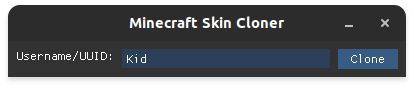
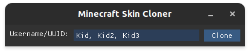

# MCSC: Minecraft Skin Cloner
A Cross-platform Minecraft skin cloner!

## Usage
To use **MCSC** you'll just need to download latest binary for your OS from the [releases](https://github.com/Kid0h/MCSC/releases) (or build from source).


Simply enter the target's Minecraft username and press `ENTER` or click `Clone`



You can ever clone multiple skins at once!




## Building from source
You'll need to clone the repository using `--recursive` in order to also clone the needed submodules too.
```
git clone --recursive https://github.com/Kid0h/MCSC
cd MCSC
mkdir build && cd build

cmake -DCMAKE_BUILD_TYPE=Release ../
cmake --build . --config Release
```
If you're using `Windows` or if CMake can't find the `curl` libraries on your machine - you'll need to supply CMake with a build of `curl`:
```
cmake -DCURL_INCLUDE_DIR="C:/path/to/curl/include" -DCURL_LIBRARY="C:/path/to/curl/library.lib" ../
```

## Reaching out
If you have any issues or questions - you can open an issue [here](https://github.com/Kid0h/MCSnatcher/issues/new)!
